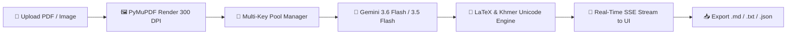

# Khmer PDF & Vision AI Engine (OCR)

[](https://fastapi.tiangolo.com/)
[](https://nextjs.org/)
[](https://ai.google.dev/)
[](https://katex.org/)
[](https://opensource.org/licenses/MIT)

An enterprise-grade, high-performance system for extracting, digitizing, and restoring **Khmer PDF documents**, scanned books, research theses, and technical papers into clean standard **Khmer Unicode Markdown** with **100% LaTeX mathematical & scientific formulas**.

---

## 📑 Table of Contents
- [🌟 Key Features](#-key-features)
- [🔄 How It Works](#-how-it-works)
- [🚀 Quick Start Guide](#-quick-start-guide)
  - [1. Backend Setup](#1-backend-setup)
  - [2. Frontend Setup](#2-frontend-setup)
  - [3. Getting Free Gemini API Keys](#3-getting-free-gemini-api-keys)
- [🖥️ Using the Web Application](#️-using-the-web-application)
  - [Tab 1: PDF Extraction (`#pdf`)](#tab-1-pdf-extraction-pdf)
  - [Tab 2: Live Activity Monitor (`#monitor`)](#tab-2-live-activity-monitor-monitor)
  - [Tab 3: Key Pool & Usage Telemetry (`#keys`)](#tab-3-key-pool--usage-telemetry-keys)
- [🔑 Multi-Key Scaling & Rate Limit Management](#-multi-key-scaling--rate-limit-management)
- [💻 Standalone CLI Batch OCR](#-standalone-cli-batch-ocr)
- [🏗️ System Architecture](#️-system-architecture)
- [📡 REST API Reference](#-rest-api-reference)
- [❓ Frequently Asked Questions (FAQ)](#-frequently-asked-questions-faq)
- [📄 License](#-license)

---

## 🌟 Key Features

- 🇰🇭 **High-Accuracy Multimodal Khmer OCR**: Powered by Google Gemini 3.6 Flash and Gemini 3.5 Flash. Accurately preserves consonant sub-clusters (ជើង), complex vowels, diacritics, and legacy font encodings.
- 📐 **100% LaTeX Mathematical & Scientific Restoration**: Automatically detects, formats, and renders complex formulas ($...$, $$...$$, fractions, square roots, matrices, chemistry equations) into KaTeX LaTeX.
- 🔑 **Multi-Account API Key Pool & Load Balancer**: Supports adding multiple Gemini API keys. The engine automatically rotates keys using round-robin scheduling, mutual exclusion pacing, and instant 429 quota failover.
- ⚡ **Zero-Downtime Auto-Failover**: When a key hits the 20 requests/day cap on `gemini-3.6-flash`, the system automatically switches to `gemini-3.5-flash` or leases the next key in the pool with zero downtime.
- 📊 **Real-Time Key Usage Dashboard**: Live telemetry tracking requests processed, tokens consumed, active cooldown countdowns, and remaining daily quota for every key.
- 🔄 **Real-Time SSE Streaming**: Live parallel page processing with visual worker chips (`P1`, `P2`), thumbnail previews, and instant page-by-page rendering.
- 🛡️ **Live API Key Verification & Auto-Purge**: Built-in verification tool that tests all keys against Google's API simultaneously and allows 1-click purging of invalid or deleted keys.
- 📥 **Multi-Format Export**: 1-click download as Markdown (`.md`), Plain Text (`.txt`), or structured JSON (`.json`).

---

## 🔄 How It Works



1. **Upload**: Drop any PDF file or image into the web interface.
2. **Page Rendering**: PyMuPDF renders pages at crisp 300 DPI high resolution.
3. **Key Leasing**: The `APIKeyPool` safely leases an available, non-busy key with mutual exclusion.
4. **Vision AI OCR**: Gemini analyzes the visual page, restoring Khmer text and formatting math formulas into LaTeX.
5. **Live Streaming**: Results stream page-by-page directly to the browser with instant KaTeX math rendering.

---

## 🚀 Quick Start Guide

### 1. Backend Setup

Open a terminal window:

```bash
# 1. Navigate to the backend directory
cd backend

# 2. Create and activate a Python virtual environment
python3 -m venv .venv
source .venv/bin/activate

# 3. Install required Python packages
pip install -r requirements.txt

# 4. Start the FastAPI backend server
uvicorn main:app --reload --host 127.0.0.1 --port 8000
```

- **Health Endpoint**: `http://127.0.0.1:8000/api/health`
- **Swagger Documentation**: `http://127.0.0.1:8000/docs`

---

### 2. Frontend Setup

Open a second terminal window:

```bash
# 1. Navigate to the frontend directory
cd frontend

# 2. Install Node.js dependencies
npm install

# 3. Start the Next.js development server
npm run dev
```

- Open your browser and navigate to **`http://localhost:3000`**.

---

### 3. Getting Free Gemini API Keys

1. Visit **[Google AI Studio (aistudio.google.com/app/apikey)](https://aistudio.google.com/app/apikey)**.
2. Sign in with your Google account.
3. Click **"Create API Key"** and copy the key.
4. Open the web app, go to the **API Keys Tab (`#keys`)**, paste your key(s), and click **"Save & Activate Pool"**.

*(Tip: You can paste multiple keys from different Google accounts to increase your daily extraction speed!)*

---

## 🖥️ Using the Web Application

### Tab 1: PDF Extraction (`#pdf`)
- **Upload Box**: Drag and drop any PDF document or image file.
- **Page Range Selector**: Extract the entire document or select a specific range (e.g. `1-20`).
- **Parallel Workers Slider**: Adjust concurrency (1 to 6 parallel workers) based on your key pool size.
- **Continuous Mode**: Append new page extractions to an existing document without restarting.
- **Live Output**: View formatted Khmer Markdown and rendered KaTeX mathematical equations in real-time.
- **Export Bar**: Download results as `.md`, `.txt`, `.json`, or copy all text to clipboard with 1 click.

### Tab 2: Live Activity Monitor (`#monitor`)
- **Real-Time Terminal**: Streams live backend events, processing latencies, worker leases, and auto-failovers.
- **Status Badges**: Filter logs by `INFO`, `SUCCESS`, `WARN`, or `RATE_LIMIT`.

### Tab 3: Key Pool & Usage Telemetry (`#keys`)
- **Global Metrics**:
  - **Requests Processed**: Total calls made across all keys today.
  - **AI Tokens Used**: Total multimodal OCR tokens consumed.
  - **Ready Keys**: Healthy, available keys ready to process pages.
  - **Remaining Quota**: Estimated daily capacity left (e.g. `~600 page/day`).
- **Live Per-Key Grid**: Shows exact requests executed, token usage, and live status for each key (`🟢 Ready`, `🔵 In-Flight`, `🟡 Cooldown`, `🔴 Daily Cap`).
- **Verify All Live**: Tests all keys against Google's API simultaneously.
- **Purge Invalid Keys**: Automatically removes broken or deleted keys with 1 click.
- **Reset Cooldowns**: Instantly unlocks cooling keys.

---

## 🔑 Multi-Key Scaling & Rate Limit Management

Google Gemini provides a free tier of **20 requests/day per key** for `gemini-3.6-flash` and **15 RPM (Requests Per Minute)**.

Adding multiple keys to your pool multiplies your daily extraction speed:

| Keys in Pool | Daily Free Capacity | Throughput (RPM) | Recommended Parallel Workers |
| :---: | :---: | :---: | :---: |
| **1 Key** | ~20 pages/day | 15 RPM | 1-2 workers |
| **5 Keys** | ~100 pages/day | 75 RPM | 2-3 workers |
| **10 Keys** | ~200 pages/day | 150 RPM | 3-4 workers |
| **30 Keys** | ~600 pages/day | 450 RPM | 4-6 workers |

### Automatic Failover Logic:
1. When a key is busy, the pool leases the next idle key.
2. If a key hits a temporary 429 rate limit, it is placed on a short cooldown (e.g. 30s) and the engine automatically retries with a replacement key.
3. If a key reaches its 20-request daily cap on `gemini-3.6-flash`, the engine automatically switches that key to **`gemini-3.5-flash`** so your document extraction finishes without interruption.

---

## 💻 Standalone CLI Batch OCR

You can also run batch OCR directly from the terminal without using the web interface:

```bash
# Extract full PDF using Gemini Vision OCR
python3 pdf_to_khmer_text.py sample.pdf --mode vision --output output.txt

# Extract specific page range (e.g. Pages 1 to 20)
python3 pdf_to_khmer_text.py sample.pdf --start-page 1 --end-page 20 -o pages_1_20.txt

# Append to existing output file
python3 pdf_to_khmer_text.py sample.pdf --start-page 21 --end-page 40 -o pages_1_20.txt --append

# Use a specific Gemini API key
python3 pdf_to_khmer_text.py sample.pdf --api-key "AIzaSy..." --mode vision -o output.txt
```

---

## 🏗️ System Architecture

```text
pdf-text/
├── backend/                      # FastAPI Python Backend
│   ├── app/
│   │   ├── api/
│   │   │   ├── routes/           # API route handlers
│   │   │   │   ├── pdf.py        # PDF extraction & SSE streaming
│   │   │   │   ├── keys.py       # Key pool status, reset & verification
│   │   │   │   ├── logs.py       # Live telemetry & log streaming
│   │   │   │   ├── health.py     # Health checks & system metadata
│   │   │   │   └── export.py     # Markdown/Text/JSON export endpoints
│   │   │   └── router.py         # Main API router registry
│   │   ├── core/
│   │   │   └── config.py         # App configuration & Gemini model settings
│   │   ├── services/
│   │   │   ├── ai_service.py     # Gemini Vision OCR & prompt engineering
│   │   │   ├── key_manager.py    # Multi-key pool rotation, leasing & cooldowns
│   │   │   ├── pdf_service.py    # PyMuPDF rendering & image extraction
│   │   │   └── log_service.py    # Ring buffer & SSE log broadcasting
│   │   └── main.py               # FastAPI application entry point
│   └── requirements.txt
│
├── frontend/                     # Next.js 16 (Turbopack) Frontend
│   ├── src/
│   │   ├── app/                  # App Router (page.tsx, layout.tsx, globals.css)
│   │   ├── components/           # UI Components
│   │   │   ├── Navbar.tsx            # Header navigation & tab switching
│   │   │   ├── FileUpload.tsx        # Drag & drop PDF/image uploader
│   │   │   ├── ProcessingBackbone.tsx# Live worker slots, progress & key pool pills
│   │   │   ├── KeyManagementView.tsx # Multi-key management & telemetry dashboard
│   │   │   ├── PageCard.tsx          # Page Markdown/KaTeX preview card
│   │   │   ├── MathRenderer.tsx      # KaTeX LaTeX formula renderer
│   │   │   └── LogMonitor.tsx        # Real-time backend terminal log viewer
│   │   └── config/api.ts         # API base URL configuration
│   └── package.json
│
├── pdf_to_khmer_text.py          # Standalone CLI batch extraction script
├── .gitignore                    # Git ignore rules
└── README.md                     # Project documentation
```

---

## 📡 REST API Reference

| Method | Endpoint | Description |
| :--- | :--- | :--- |
| `GET` | `/api/health` | Health status and supported models list |
| `POST` | `/api/extract-preview` | Extracts page count, metadata, and visual thumbnails |
| `POST` | `/api/extract-correct-stream` | Server-Sent Events (SSE) live extraction & OCR stream |
| `POST` | `/api/reprocess-page` | Re-runs OCR restoration on a single specific page |
| `POST` | `/api/key-pool-status` | Real-time key usage, tokens, and cooldown status |
| `POST` | `/api/keys/verify` | Validates multiple API keys against Google's API |
| `POST` | `/api/keys/reset-cooldowns`| Clears all cooldowns and unlocks all keys |
| `POST` | `/api/keys/reset-invalid`  | Clears invalid key cache for fresh re-testing |
| `GET` | `/api/logs` | Fetches historical backend telemetry logs |
| `GET` | `/api/logs/stream` | Server-Sent Events (SSE) real-time log event stream |

---

## ❓ Frequently Asked Questions (FAQ)

#### Q: What happens when I see `Daily Cap` on my keys?
**A:** Google gives 20 free requests per day on `gemini-3.6-flash`. When this cap is reached, our system automatically continues processing your pages using **`gemini-3.5-flash`** (or you can wait for Google's daily quota reset at 7:00 AM ICT).

#### Q: How many API keys should I add?
**A:** Adding **10 to 30 keys** allows you to process entire books or multi-chapter research theses in parallel at high speed.

#### Q: Are my API keys stored on a server?
**A:** No. Your API keys are stored securely in your browser's `localStorage` and sent directly to your local FastAPI backend server.

---

## 📄 License

This project is open-source and licensed under the [MIT License](LICENSE).
